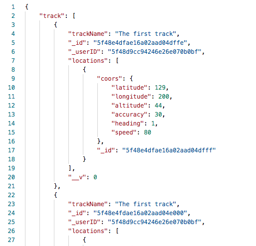
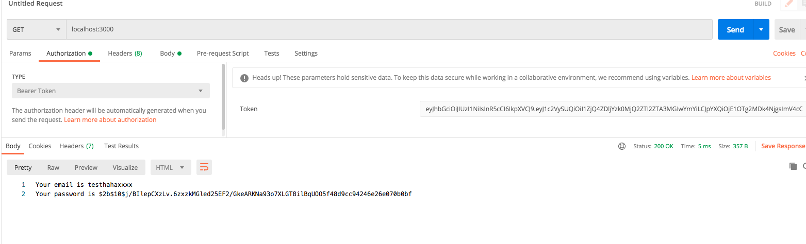
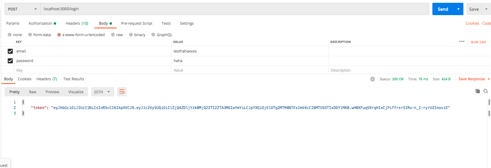

[](http://expressjs.com/)
[](https://nodei.co/npm/mongodb/) 
[](http://travis-ci.org/mongodb/node-mongodb-native)
[](https://coveralls.io/github/mongodb/node-mongodb-native?branch=2.1)
[](https://gitter.im/mongodb/node-mongodb-native?utm_source=badge&utm_medium=badge&utm_campaign=pr-badge)

#  <b>BACK-END for tracking-app

## Written by <b>Vudang


#  <b>I.Install Library


```
yarn init
yarn add bcrypt express jsonwebtoken 
mongodb mongoose ngrok nodemon
```
# <b> II.Project structures
```
    src
  |__ middlewares
  | |__ auth.js
  | |__ task.js
  | |__ ... (one reducer per file)
  | |__ index.js (root reducer) -> Use combineReducers here ^^
  |
  |__ models
  | |__ auth.js
  | |__ task.js
  | |__ ...
  |
  |__ routes
  | 
  |__ index.js (setup Store Provider) -> Wrap components here 
```

# <b> III.Database Setup
  ## Make sure you installed MongoDB
  

  - MACOS
    ```
    https://docs.mongodb.com/manual/tutorial/install-mongodb-on-os-x/
    ```
  - Windows
    ```
    https://docs.mongodb.com/manual/tutorial/install-mongodb-on-windows/
    ```
  ## Make sure you create -dbpatch for MongoDB
  ## Make sure MongoDB is running

#  <b>IV.Let's Go
  ## Getting Started
  ##  <b> 1. Create endpoint (index.js)
  
  
  - To create a database in MongoDB, start by using mongoose.connect() , then specify a connection URL with the correct ip address and the name of the database you want to create.MongoDB will create the database if it does not exist, and make a connection to it.
  
    ```c
    const mongoose = require('mongoose');
    const express = require('express');
    const bodyParser = require('body-parser');

    const connectionString = 'mongodb://localhost/trackingDatabase'
    const configOption = {
      useNewUrlParser: true,
      useUnifiedTopology: true
    }

    mongoose.connect(connectionString, configOption);

    mongoose.connection.on('error', (err) => {
      console.log(err);
    })

    mongoose.connection.on('connected', () => {
      console.log('Mongoose connected successfully')
    })

    const app = express();
    app.use(bodyParser.json());


    app.listen(3000, () => {
      console.log('Server is running on port 3000')
    })
    ```

  ##  <b>2. Create our model 
  

  - ### USER MODEL
    - The first we import 2 libraries : mongoose and bcrypt
    - Create UserSchema for Validation
    ```c
    const mongoose = require('mongoose');
    const brcrypt = require('bcrypt');

    const UserSchema = new mongoose.Schema({
      email:{
        type:String,
        unique:true,
        required:true
      },
      password:{
        type:String,
        required:true
      }
    })

    // Hooks 
    /* 1.We get context of this Model (use declare function not use arrow function)
    * 2.Validation if user isModified (existing -> resolve done() )
    * 3.Else we call bcrypt function genSalt (valueSalt)
    * 4.Then we call hash function (hash password with salt value above)
    * 5.Finally we set user password to hash value
    * 6.We must define parameter done for resolve middlewares if we dont have request cant be done.
    *  */ 
    UserSchema.pre('save',function(done){
      const user = this;
      if(!user.isModified('password')) 
        return done();
      brcrypt.genSalt(10,(err,salt) => {
        if(err) 
          return done(err);
        brcrypt.hash(user.password,salt,(err,hash) => {
          if(err)
            return done(err);
          user.password = hash;
          done();
        });
      });
    });

    //Compare
    /**
    * 1.Add new property for UserSchema call it comparePassword
    * 2.Return new Promise with compare method of bcrypt
    * 3.Compare parameter password with hash value in out database
    */

    UserSchema.methods.comparePassword = function comparePassword(comparePassword){
      const user = this;
      return new Promise((resolve,reject) => {
        brcrypt.compare(comparePassword,user.password,(err,isMatchPassword) => {
          if(err)
            return reject(err)
          if(!isMatchPassword)
            return reject(false);
          resolve(true)
        })
      })
    }
    mongoose.model('User',UserSchema);
    ```
  - ### TRACK MODEL
      ``` c
      const mongoose = require('mongoose');
      // Point Schema save our coordinate
      const PointSchema = new mongoose.Schema({
        timstamp:Number,
        coors:{
          latitude:Number,
          longitude:Number,
          altitude:Number,
          accuracy:Number,
          heading:Number,
          spead:Number
        }
      });

      // Track Schema store our User with their locations
      const TrackSchema = new mongoose.Schema({
        _userID:{
          type:mongoose.Schema.Types.ObjectId,
          ref:'User'
        },
        trackName:{
          type:String,
          default:''
        },
        locations:[PointSchema]
      })
      mongoose.model('Track',TrackSchema);
      ```
  - Now,we have 2 models : 
    - User model : describe user in our database.
    - Track model : describe location with user.

  ##  <b>3.Create our middlewares
  

  - We need to check JWT has been available from request header.If we have JWT we can access application,otherwise not.After resolve middlewares,we will send user information to client.
  ```c
  const { response } = require('express');
  const jwt = require('jsonwebtoken');
  const mongoose = require('mongoose');
  const User = mongoose.model('User');

  const SECRET_KEY = 'YOUR_SECRET_KEY';
  const JWT_OPTIONS = {
    expiresIn:'7d'
  }

  const authenticationMiddleware =  (request,response,next) => {
    const {authorization} = request.headers;
    if(!authorization){
      return response.status(401).send({error:'You must have token'});
    }

    const token = authorization.replace('Bearer ','');
    
    jwt.verify(token,SECRET_KEY,JWT_OPTIONS,async (err,payload) => {
      if(err){
        return response.status(401).send({err:'You must have token'});
      }
      const {userID} = payload;
      const user  = await User.findById({_id:userID});
      request.user = user;
      next();
    })
  }

  module.exports = authenticationMiddleware;

  ```
  ##  <b>4. Create our routes  
  

  - ### Authentication Router
    ```c
    const mongoose = require('mongoose');
    const express = require('express');
    const jwt = require('jsonwebtoken');

    const router = express.Router();
    const User = mongoose.model('User');

    const SECRET_KEY = 'YOUR_SECRET_KEY';
    const JWT_OPTIONS = {
      expiresIn:'7d'
    }
    router.post('/register',async (request,response) => {
      const {email,password} = request.body;
      try{
        const user = new User({email:email,password:password});
        await user.save()
        const token = jwt.sign({userID:user._id},SECRET_KEY,JWT_OPTIONS)
        response.send({token})
      }
      catch(err){
        return response.status(422).send(err.message)
      } 
    })

    router.post('/login',async (request,response) => {
      const {email,password} = request.body;
      if(!email || !password){
        return response.status(422).send({error:'Youst must provide email and password'})
      }
      const user = await User.findOne({email});
      if(!user){
        return response.status(404).send({error:'Invalid email or password'})
      }
      try {
        await user.comparePassword(password);
        const token = jwt.sign({userID:user._id},SECRET_KEY,JWT_OPTIONS)
        response.send({token})
      }
      catch(err){
        return response.status(422).send({err:'Invalid password or email'})
      }
    })

    module.exports = router;
    ```
    - We create authentication router for our sever : /register and /login. They are using POST method, because we want to send email and password from request body to our server.
    - POST/Register : We are making async function that await User model create an instance and signup new JWT send it to client.
    - POST/Login : We are making async function that await our database find user.If we find,we also send it to client.comparePassword is a method we define in User model throught out Property.
  - ### Track Router
    ```c
    const express =require('express');
    const mongoose = require('mongoose');
    const authenticationMiddleware = require('../middlewares/authMiddleware');
    const Track = mongoose.model('Track');
    const router = express.Router();
    router.use(authenticationMiddleware);

    router.get('/tracks',async (request,response) => {
      try {
        const track = await Track.find({_userID:request.user._id});
        response.send({track})
      }
      catch(err){
        response.status(404).send({error:'Dont find track'})
      }
    })

    router.post('/tracks',async (request,response) => {
      const {trackName,locations} = request.body;
      console.log(request.body)
      if(!trackName || !locations) 
        response.status(422)
        .send({error:'You must have track name and locations'})
      try {
        const newTrack = new Track({
          _userID:request.user._id,
          trackName,
          locations
        })
        await newTrack.save();
        response.send(newTrack)
      }
      catch(err) {
        response.status(422).send({error:err.message})
      }
    })
    module.exports = router;
    ```
    - We build 2 HTTP Methods:
      - 1.GET TRACKS: This method get all track with _userID provide in middlewares. So we must have router.use(authMiddleware)
      - 2.POST TRACKS: This method create a POST HTTP REQUEST to server and create newTrack,with trackName and locations were provided by request body,and _userID from middlewares.
    - So we can recognize the important of JWT in this Server.Many data,many information have been protected by JWT and we can use it too easy with Token.

  ##  <b>5. TEST OUR SERVER  
  
    
      
